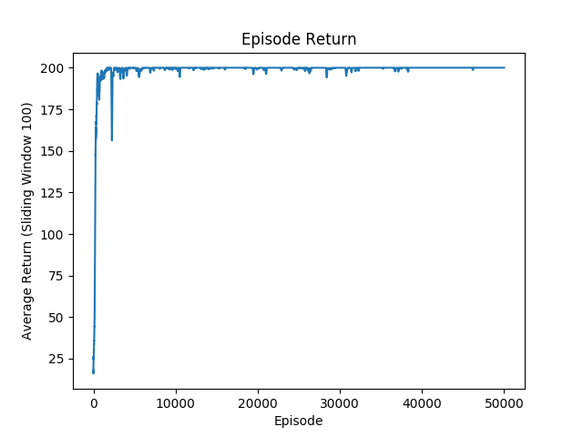
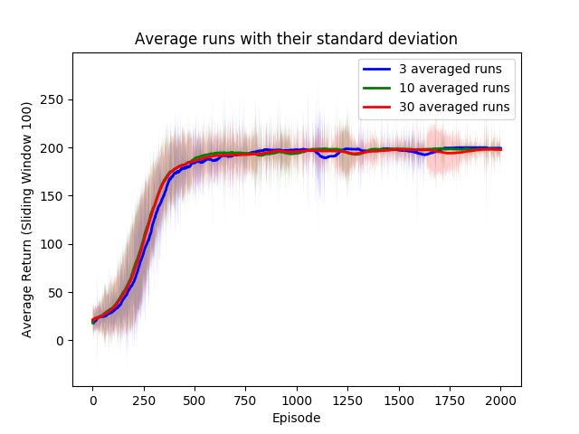
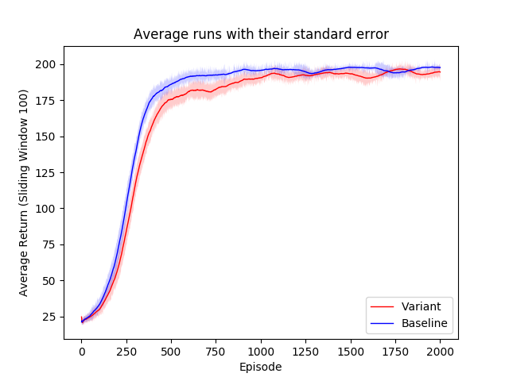

# Reinforce With Baseline in PyTorch

An implementation of Reinforce Algorithm with a parameterized baseline, with a detailed comparison against whitening.
##Performance of Reinforce trained on CartPole

##Average Performance of Reinforce for multiple runs

##Comparison of subtracting a learned baseline from the return vs. using return whitening

